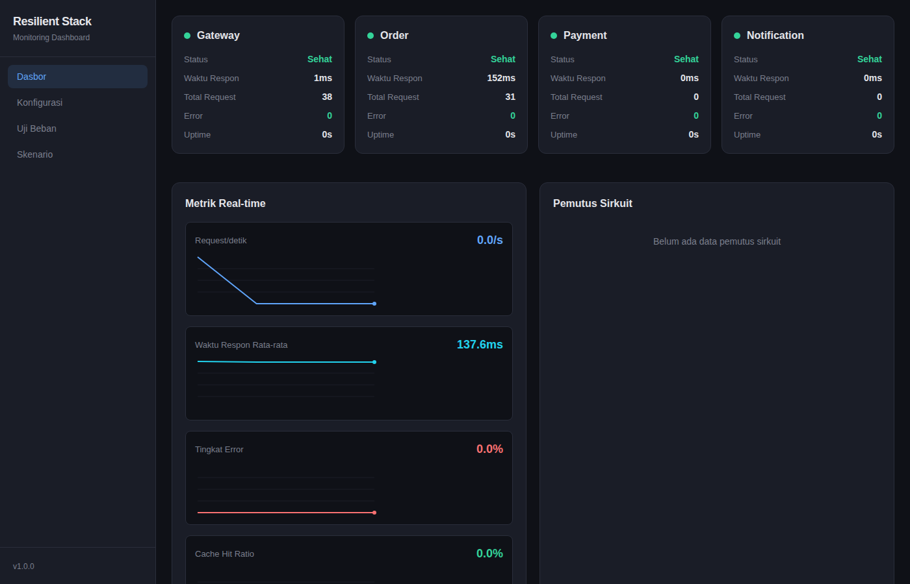
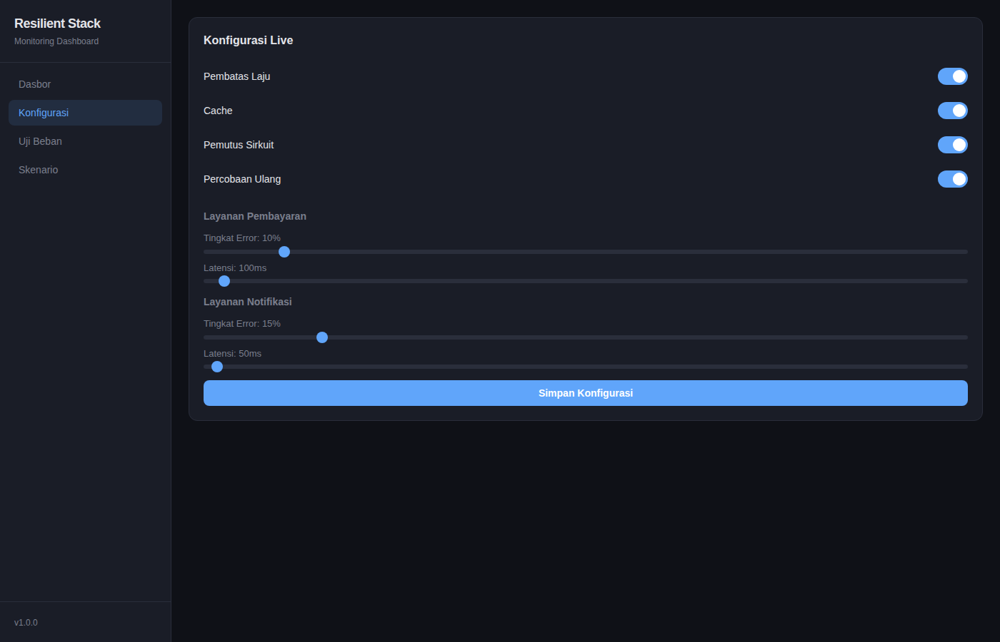
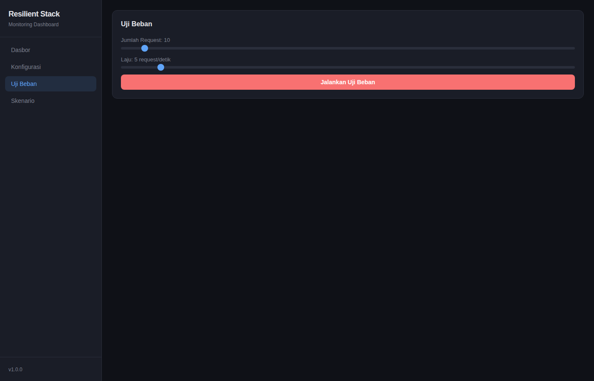
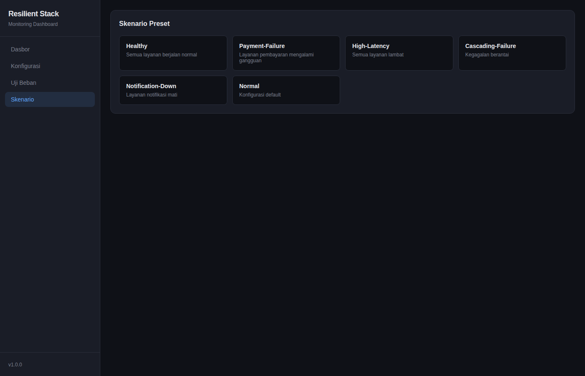

# Resilient Stack

A production-grade distributed systems demo showcasing resilience patterns — circuit breaker, retry with exponential backoff, rate limiting, caching, and load balancing — all observable in real-time through a monitoring dashboard.

## Architecture

```
                    ┌─────────────────────────┐
                    │   Dashboard (React)      │
                    │   localhost:3000         │
                    └──────────┬──────────────┘
                               │ SSE + REST
                    ┌──────────┴──────────────┐
                    │    API Gateway (Hono)    │
                    │    localhost:4000        │
                    │  Rate Limiter            │
                    │  Load Balancer           │
                    │  Circuit Breaker         │
                    └──┬──────────┬───────┬───┘
                       │          │       │
              ┌────────┴──┐ ┌────┴────┐ ┌┴───────────┐
              │ Order Svc │ │Payment  │ │Notification│
              │ :4001     │ │:4002    │ │:4003       │
              │ +Cache    │ │+Fail    │ │+Queue+DLQ  │
              │ +Retry    │ │ Sim     │ │            │
              └───────────┘ └─────────┘ └────────────┘
```

## Features

### Resilience Patterns

| Pattern | Implementation | Observable Behavior |
|---------|---------------|-------------------|
| **Circuit Breaker** | State machine: closed → open → half-open → closed | Dashboard shows state transitions in real-time |
| **Retry** | Exponential backoff with jitter | Failed requests automatically retried with increasing delays |
| **Rate Limiter** | Token bucket algorithm | Requests rejected with 429 when limit exceeded |
| **Cache** | In-memory with TTL | Hit/miss ratio displayed on dashboard |
| **Load Balancer** | Round-robin, least-connections, random | Request distribution across instances |

### Dashboard

Real-time monitoring dashboard built with React + Vite:

- **Service Status Grid** — Health status, response time, request count per service
- **Real-time Metrics** — Requests/s, avg response time, error rate, cache hit ratio (SVG charts)
- **Circuit Breaker Panel** — State visualization with failure/success counters
- **Configuration Panel** — Live toggle switches for all resilience patterns
- **Load Test Panel** — Generate configurable traffic bursts
- **Scenario Presets** — One-click failure simulations
- **Event Log** — Real-time scrolling log with color-coded severity

### Scenario Presets

| Scenario | Description |
|----------|------------|
| **Healthy** | All services running normally |
| **Payment Failure** | Payment service experiencing 80% failure rate |
| **High Latency** | All services slow due to high load |
| **Cascading Failure** | Failure propagation across all services |
| **Notification Down** | Notification service unavailable |
| **Normal** | Default configuration with moderate error rates |

## Tech Stack

- **Runtime**: Bun
- **Backend**: Hono (lightweight TypeScript framework)
- **Frontend**: React + Vite
- **Monorepo**: Bun workspaces
- **Language**: TypeScript (strict mode)

## Quick Start

```bash
# Clone the repo
git clone https://github.com/syawqy/resilient-stack.git
cd resilient-stack

# Install dependencies
bun install

# Start all backend services
bun run apps/svc-payment/src/index.ts &
bun run apps/svc-notification/src/index.ts &
bun run apps/svc-order/src/index.ts &
bun run apps/gateway/src/index.ts &

# Start the dashboard
bun run --cwd apps/dashboard dev
```

Open [http://localhost:5173](http://localhost:5173) to access the dashboard.

## Project Structure

```
resilient-stack/
├── apps/
│   ├── gateway/              # API Gateway (port 4000)
│   ├── svc-order/            # Order Service (port 4001)
│   ├── svc-payment/          # Payment Service (port 4002)
│   ├── svc-notification/     # Notification Service (port 4003)
│   └── dashboard/            # React monitoring dashboard
├── packages/
│   ├── shared/               # Shared types and constants
│   ├── resilience/           # Circuit breaker, retry, rate limiter, load balancer
│   ├── cache/                # In-memory cache with TTL
│   └── metrics/              # Metrics collector + SSE broadcaster
└── docs/
    └── ARCHITECTURE.md       # Detailed architecture documentation
```

## API Endpoints

### Gateway (port 4000)

| Method | Endpoint | Description |
|--------|----------|-------------|
| GET | `/api/health` | Gateway health check |
| GET | `/api/metrics` | SSE stream of real-time metrics |
| POST | `/api/config` | Update live configuration |
| GET | `/api/scenarios` | List available scenario presets |
| POST | `/api/scenarios/:name` | Activate a scenario preset |
| POST | `/api/load-test` | Generate burst traffic |
| ALL | `/api/orders/*` | Proxy to Order Service |
| ALL | `/api/payments/*` | Proxy to Payment Service |
| ALL | `/api/notifications/*` | Proxy to Notification Service |

### Order Service (port 4001)

| Method | Endpoint | Description |
|--------|----------|-------------|
| GET | `/orders` | List all orders (cached) |
| POST | `/orders` | Create order + process payment + notify |
| GET | `/orders/:id` | Get order by ID |
| GET | `/health` | Health check |

### Payment Service (port 4002)

| Method | Endpoint | Description |
|--------|----------|-------------|
| POST | `/payments/process` | Process payment (configurable failure rate) |
| POST | `/config` | Update fail rate and latency |
| GET | `/health` | Health check |

### Notification Service (port 4003)

| Method | Endpoint | Description |
|--------|----------|-------------|
| POST | `/notifications/send` | Send notification |
| GET | `/notifications` | List all notifications |
| GET | `/notifications/queue` | Dead letter queue |
| GET | `/health` | Health check |

## Dashboard Screenshots

### Main Dashboard


### Configuration Panel


### Load Test Panel


### Scenario Presets


## Use Cases

This project demonstrates patterns essential for:

- **E-commerce platforms** — Rate limiting, caching, payment retry logic
- **Fintech applications** — Circuit breakers, idempotent transactions, audit trails
- **SaaS products** — Observability, graceful degradation, SLA monitoring
- **Government/Enterprise** — Resilient architectures, compliance-ready patterns

## License

MIT
